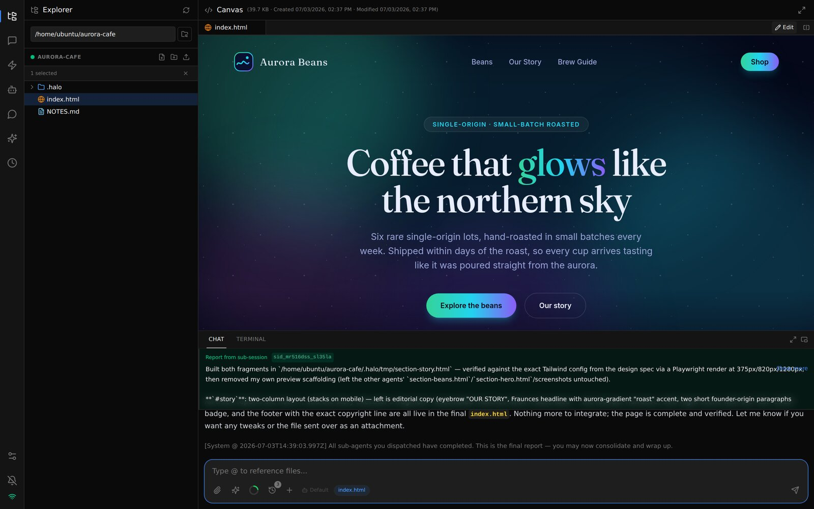
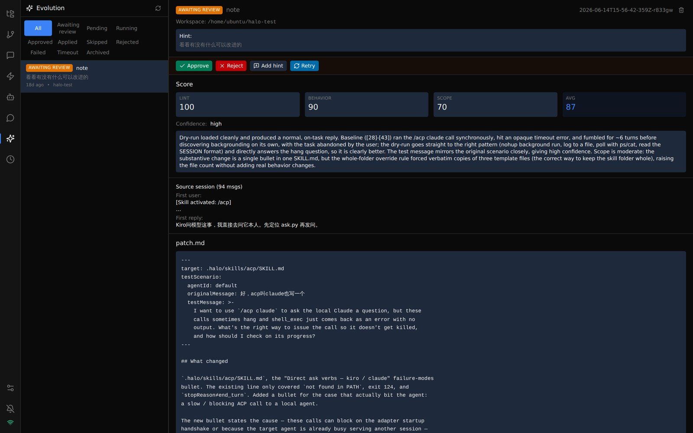
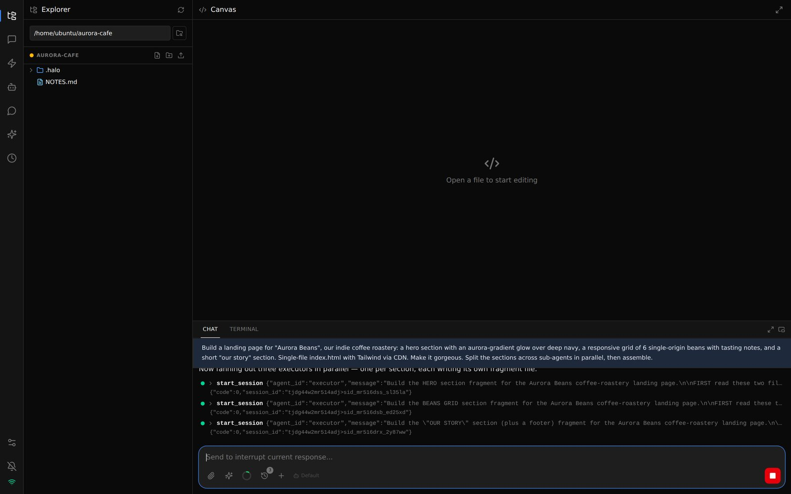
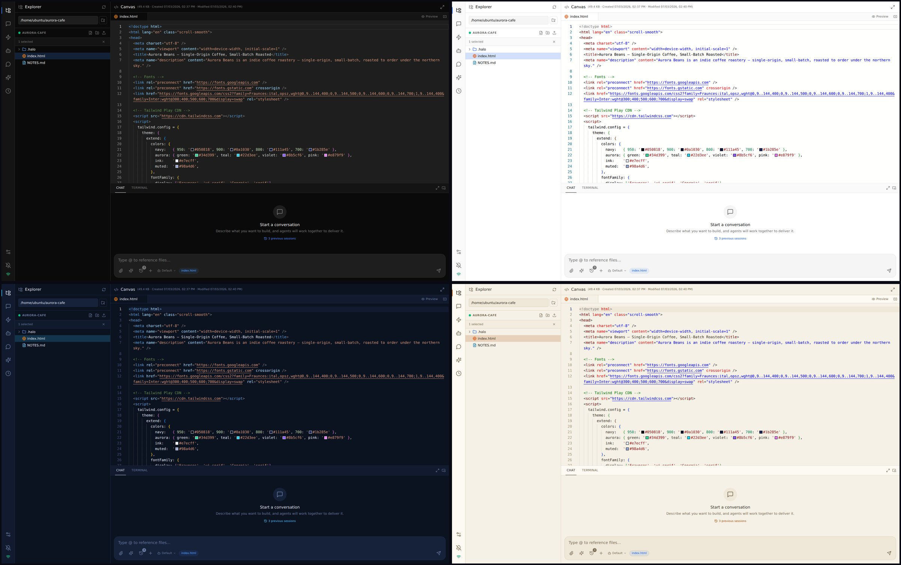
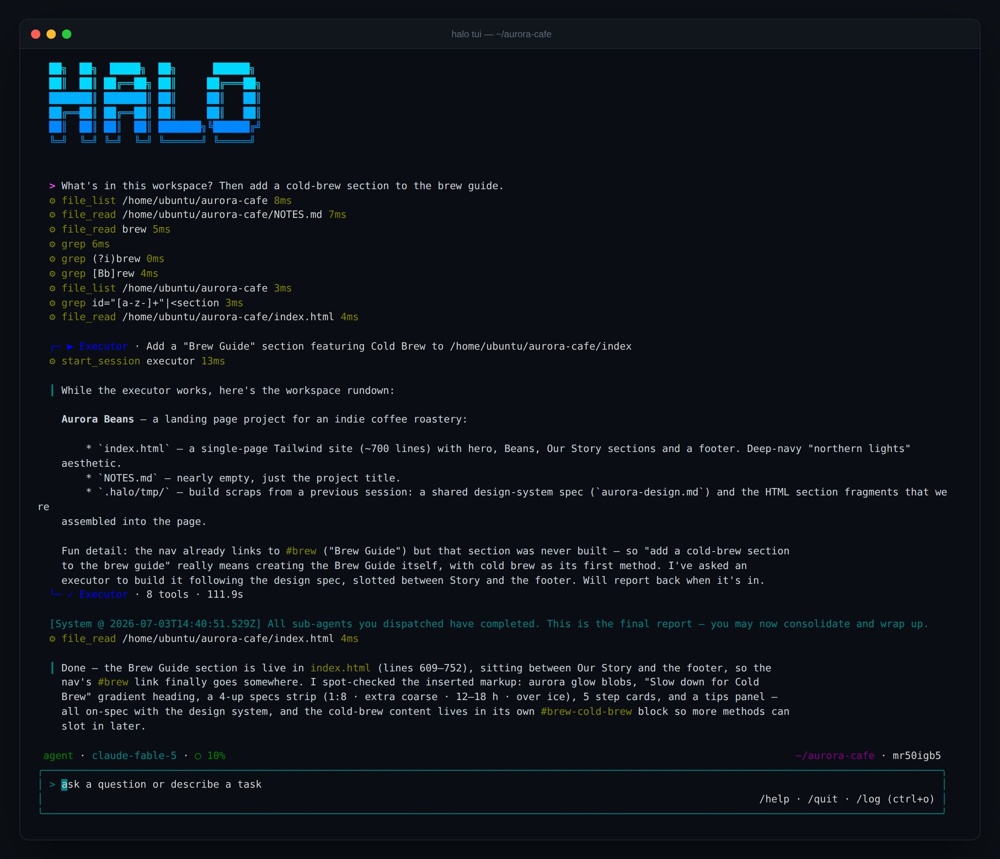
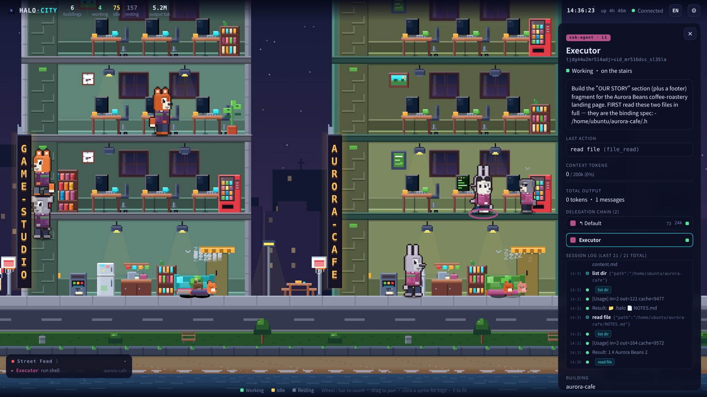

# Halo

[](https://www.npmjs.com/package/@turmind/halo)
[](LICENSE)
[](https://nodejs.org)

[English](README.md) | [中文](README.zh-CN.md)

**Throw in an idea. A team of agents builds it.**

Halo is a multi-agent workspace you drive in plain language. A primary agent reads your intent, breaks the work down, and fans it out to sub-agents that run in parallel — while every reasoning step and tool call streams by live, and you interrupt, redirect, or take over whenever you like. Everything the team knows and produces is plain files in a workspace you can read, edit, `git clone`, and share. No hidden memory. No opaque state.


<p align="center"><sub>One prompt — <i>“Build a landing page for our coffee roastery… split the sections across sub-agents in parallel, then assemble.”</i> Executors fan out, report back, and the assembled page previews in Canvas, all in one browser tab.</sub></p>

## Install

```bash
npm install -g @turmind/halo   # one binary, all subcommands
halo setup                     # interactive: password / port / model keys / optional skills
halo server start              # → open http://localhost:9527
```

> [!IMPORTANT]
> **First message fails with `Could not load credentials from any providers`?** API keys entered during `halo setup` are stored but **not auto-bound to any agent** — the built-in `default` agent initially points at AWS Bedrock. Open **Agents → default** in the admin and switch its model provider to the one you configured. (Bedrock users with a working AWS credential chain are unaffected.) Details in [Quick Start](#quick-start).

## Why Halo

### 🧬 It rewrites its own prompts — and you review the diff

Halo learns from its own conversations. Run `/evo` (or let pre-compact trigger it): an internal evolution agent analyzes the session, drafts a patch to the workspace's own prompt files, dry-runs the patched agent in a sandbox against the original scenario, and a scoring agent grades the outcome. You approve or reject in the **Evolution** tab; approved patches merge back into the workspace. Real file diffs reviewed by you — not silent fine-tuning.


<p align="center"><sub>A real run awaiting review: lint / behavior / scope scores, the grader's reasoning, and the patch itself — one click merges it into the workspace.</sub></p>

### 📁 The whole agent team is one folder

Personas, skills, knowledge, session history — the entire agent team lives under `.halo/` as plain files:

```
my-project/
├─ .halo/
│  ├─ agents/     # who's on the team — persona, model, tools per agent
│  ├─ skills/     # what they can do — markdown, injected on demand
│  ├─ docs/       # what they've learned — knowledge they read & write
│  ├─ memory/     # dated decision notes
│  └─ sessions/   # every conversation, replayable
└─ src/ …         # your actual project
```

`git clone` the workspace and the recipient gets a complete, runnable agent team — not an export, the real thing. It's also what makes self-evolution possible: the evolution agent edits real files, and you review real diffs.

### 🌐 One workspace, every screen

Kick off a build in the browser, check progress from WeChat on the metro, drop a follow-up in Telegram or Slack, finish in the terminal. Every channel connects to the *same* workspace and session — channels are doors, the workspace is the room.

<p align="center">
  
  &nbsp;&nbsp;
  
</p>
<p align="center"><sub>The same workspace, continued from WeChat and Telegram on a phone.</sub></p>

### 👁 Watch it think

Every reasoning step, tool call, and file change streams in real time — including inside sub-agents. Interrupts are graceful (conversation repair, not a hard kill), and sub-agents report back when done. You stay in the loop instead of running and praying.


<p align="center"><sub>The primary agent fans out three executors in parallel — every <code>start_session</code> and tool call visible as it happens.</sub></p>

And when you'd rather have ambience than logs: [Halo City](#halo-city) renders the same runtime as a living pixel town.

## Also in the box

- **11 model providers, one runtime** — provider and model set per-agent: Claude on Bedrock for the heavy lifting, a cheap regional model for routine sub-tasks. No code changes.
- **IDE-grade admin** — chat + Monaco editor + file explorer + git panel + terminal (xterm.js) in one browser tab.
- **Skills** — markdown skill definitions injected into prompts on demand; workspace-scoped or global, no code required.
- **Cron tasks** — scheduled agent runs (recurring or one-shot) whose output fans out to your chat channels.
- **Permission isolation** — `full` / `workspace` / `readonly` access levels enforced by a bubblewrap sandbox (filesystem only — see [Status & Limitations](#status--limitations)).
- **ACP adapter** — plug a halo workspace into Claude Code as a native ACP agent, or let one halo delegate to another.
- **Structured sessions** — hierarchical parent ↔ child sessions with async coordination and auto-reports on completion.

## New in v0.2.1

- 🎨 **Four UI themes** — dark, light, midnight, warm; synced server-side so every browser gets your pick.
- ⌨️ **TUI overhaul** — reworked input, verbose mode, and persistent history in the standalone terminal client.
- 🏙 **Halo City performance** — viewport culling + offscreen skyline; smooth on busy servers.
- 📊 **PPTX speaker-notes sidebar** — the slide preview now shows the notes lane alongside slides.
- ✂️ **Graceful interrupts, fully surfaced** — interrupted tool calls are repaired and shown in the session UI instead of vanishing.



## Quick Start

Published on npm as [`@turmind/halo`](https://www.npmjs.com/package/@turmind/halo) — one binary, all subcommands. After the three install commands above, open **http://localhost:9527**.

| Prerequisite | Notes |
|---|---|
| Node.js >= 22 | the only hard system requirement |
| An API key for any supported model provider | entered during `halo setup`; AWS Bedrock users can leave keys unset and use the standard credential chain (env / `~/.aws` / instance role) instead |
| pnpm >= 9 | source builds only |

- **Bind your provider to the agent**: `halo setup` stores keys; agents choose providers. The built-in `default` agent ships pointing at AWS Bedrock, so if you configured a different provider, switch it once in **Agents → default → model provider** — your first conversation will thank you.
- **Upgrade**: `halo upgrade && halo server restart`. The startup check refreshes bundled docs / agents / skills automatically when the on-disk template version is behind.
- **Docker / CI**: `halo setup --non-interactive` and supply credentials via the `HALO_PASSWORD` env var.
- **From source**: `pnpm install && pnpm build`.

### Talk to it from curl

Every workspace can expose a token-authenticated HTTP + SSE endpoint — the Web channel, aka the "build your own UI" channel:

1. In the admin, open **Channels → Web → Add Account**, pick a workspace and access level, and copy the token (shown once).
2. Stream a conversation:

```bash
curl -N -H "x-token: $TOKEN" -H "Content-Type: application/json" \
  -d '{"message":"What files are in this workspace?"}' \
  http://localhost:9527/api/web/chat
```

The response is SSE frames — `session` / `thinking` / `tool_call` / `stream` / `complete` — full protocol in [`.halo/docs/guide/channels/web.md`](.halo/docs/guide/channels/web.md).

## Models

Configured per-agent through one provider-agnostic runtime. AWS Bedrock Claude is the primary target; the rest are first-class.

| Provider | Notes |
|---|---|
| **AWS Bedrock Claude** | Primary — Bedrock Invoke API |
| AWS Bedrock Mantle | OpenAI GPT-class models via Bedrock |
| Anthropic | Direct API |
| OpenAI | Direct / any OpenAI-compatible endpoint |
| DeepSeek | |
| Kimi (Moonshot AI) | |
| MiniMax | |
| Mimo (Xiaomi) | Anthropic-compatible gateway, 1M context |
| Qwen (Aliyun) | |
| Hunyuan (Tencent) | |
| Doubao (Volcengine) | |


## Channels

Every channel shares the same workspace and session state. Onboarding guides live under [`.halo/docs/guide/channels/`](.halo/docs/guide/channels/).

| Channel | Transport | Notes |
|---|---|---|
| **Admin** | WebSocket | Full-featured browser UI |
| **Web** | HTTP + SSE | Token-authenticated API, independently deployable — see [curl example](#talk-to-it-from-curl) |
| **CLI / TUI** | local | Standalone terminal client, embedded agent loop (no server required) |
| **Telegram** | Bot API | Long polling |
| **Slack** | Socket Mode | No public webhook required |
| **Feishu / Lark** | Long-connect | `appId` + `appSecret` |
| **WeChat** | QR bind | Scan to bind, mobile access |
| **ACP adapter** | stdio JSON-RPC | Bridges ACP clients (Claude Code, etc.) onto the Web channel |


<p align="center"><sub>The TUI runs the same agent loop in your terminal — here delegating to an executor and consolidating its report, no server needed.</sub></p>

## Halo City

A read-only pixel city that visualizes a live halo server: each workspace is a building, each session an animal citizen — at a desk when working, grabbing coffee or hitting the arcade when idle. Click any citizen to inspect the real thing: live session log, delegation chain, last tool call, token usage. Pure client-side canvas on a single polling endpoint — **zero model tokens burned**.


<p align="center"><sub>Street level: three sub-agent citizens heads-down in the <code>aurora-cafe</code> building; the inspector shows one executor's live log and delegation chain.</sub></p>

Lives at [`halo-city/`](halo-city/) (plain static files, no build) — see the [design notes](.halo/docs/design/halo-city.md).

## Tech Stack

- **Monorepo**: pnpm workspace (`core`, `server`, `admin`, `cli`, `desktop`, `acp-adapter`, `web-demo`)
- **Backend**: Hono + WebSocket, single Node.js process on port 9527
- **Frontend**: Next.js 15 static export, served directly by Hono
- **Agent**: custom orchestration loop, provider-agnostic `ModelRuntime` interface
- **Storage**: SQLite + Drizzle ORM — no external services to stand up
- **Runtime**: Node.js 22+, ESM, TypeScript strict

## Docs

- [`.halo/INDEX.md`](.halo/INDEX.md) — project overview + doc index
- [`.halo/docs/requirements/overview.md`](.halo/docs/requirements/overview.md) — product concept
- [`.halo/docs/design/architecture.md`](.halo/docs/design/architecture.md) — backend architecture
- [`.halo/docs/design/evolution.md`](.halo/docs/design/evolution.md) — self-evolution design
- [`.halo/docs/guide/channels/`](.halo/docs/guide/channels/) — per-channel onboarding guides
- [`.halo/docs/dev/deploy.md`](.halo/docs/dev/deploy.md) — deployment (systemd / Nginx)
- [`.halo/docs/dev/env.md`](.halo/docs/dev/env.md) — env vars, build commands
- [`CLAUDE.md`](CLAUDE.md) — development instructions for Claude Code

## Status & Limitations

Halo is young and single-maintainer. It runs, but treat it as an early-stage project, not a hardened product:

- **Sandbox isolates the filesystem, not the network.** The bubblewrap sandbox covers access levels and filesystem reach (host paths, `~/.aws`/`~/.ssh` masked), but does **not** isolate the network — code running inside it can still make outbound connections. The threat model is accidental damage and path escape by a trusted agent, **not** containment of a deliberately malicious skill exfiltrating data. Network isolation is on the roadmap.
- **No automated test suite yet.** Correctness rests on review and manual verification. Targeted tests for the externally-fixed contracts (session-file format, WS protocol) are planned over broad unit coverage.
- **Single maintainer, minimal external validation.** Expect rough edges; APIs and on-disk formats may still change between versions.

If you hit something broken or surprising, please open an issue — early feedback is genuinely useful right now.

## License

MIT
