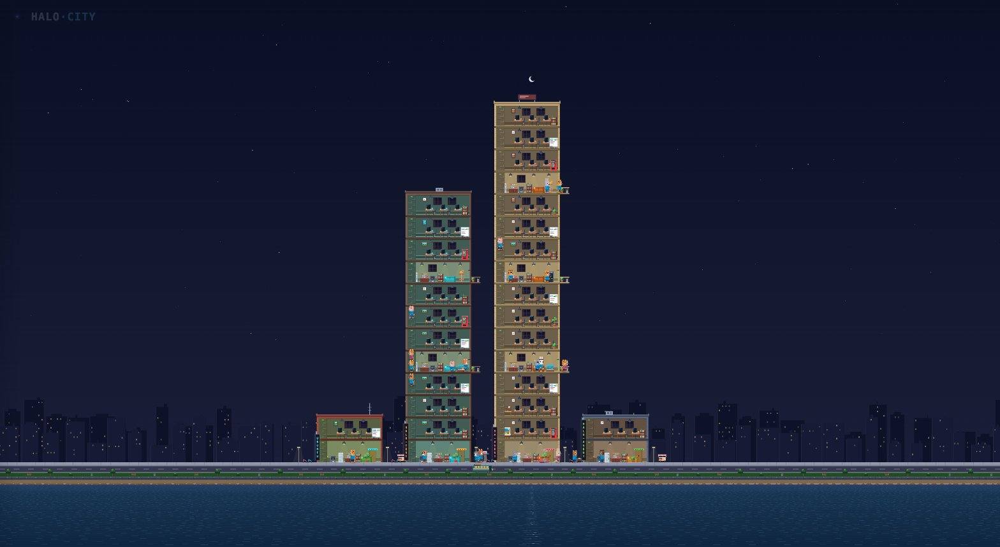

# Halo City · 像素街区



The Halo server as a living **city block at street level** — a side-view,
cross-section pixel city under a real-time sky. Every **workspace is its own
building** (material, signage, roofline and amenities all rolled from its id),
every **agent session is a chibi ANIMAL citizen** — cat, dog, fox, bear,
rabbit, panda, tiger, pig, owl or koala — who climbs real stairs to a real
desk. Clicking anyone opens their **actual session log** streamed from the
server — not a guess, the same messages the admin panel sees.

Read-only, zero build step, zero sprite assets (every pixel is code). Network
traffic: one `GET /api/show/state` poll, plus `GET /api/show/session` while an
inspector panel is open.

## The street

```
   ☀/☾  parallax skyline · clouds · stars ──────────────────────────
   ┌─[roof: water tank / AC / antenna / billboard]─┐
   │ W3  desks ×3 · skill station · flavor prop    │
   ├───────────────────────────────────────────────┤   ┌──────────┐
   │ C   公共层: 冰箱·水吧·书架·沙发·街机/鱼缸/猫 ─[阳台]│   │ next     │
   ├───────────────────────────────────────────────┤   │ building │
   │ W2 / W1  work floors …                        │   │          │
   ├───────────────────────────────────────────────┤   │          │
   │ 大堂: 前台 · 咖啡机 · 沙发 · 大门               │   │          │
   └─⌐stairs──────────────────────────────awning───┘   └──────────┘
 ──┴── sidewalk · 餐车 · 野餐桌 · 篮筐 · 单车架 · 路灯 ──┴───────────
      road        (楼距加宽:巷子就是楼下放风的地方)
```

| 看到的 | 意思 |
|---|---|
| 🏬 一栋楼 | 一个 workspace。**每 3 个工作层插 1 个公共层**(楼够高时),楼层数贴着 root 会话数走(增长即长,回落留 1 层缓冲再缩,避免屋顶抖动);砖材/霓虹竖牌/楼顶装置由 id hash 决定 |
| 🐾 动物市民 | 一个 agent session。**制服**(衬衫+条纹)认 agent 名 → 在哪都认得出"researcher";**物种/毛色/花纹/配件**(10 物种 × 多毛色 × 眼镜/耳机/斑纹)认 session id → 同 agent 并发的 session 是穿同款衬衫的不同动物。会眨眼,说话动嘴,狗走路摇尾巴 |
| 🪜 楼梯间 | 大楼左侧,真的逐层爬上爬下(没有传送) |
| 💺 工作层 | 每层 3 张工位(按 agent 名固定)+ 1 个技能站 + 随机小设施(盆栽/小书架/白板/售货机);干活时屏幕滚代码 |
| 🍵 公共层 | 冰箱(偶尔开门漏光)、水吧(水壶冒汽)、书报架、沙发,外加街机/鱼缸/猫爬架三选一;右侧伸出**阳台**(烟灰桶+盆栽)——抽烟点 |
| 🚬 习惯 | 每个 session 由 id hash 派生 **3 个固定偏好**(抽烟/咖啡/泡茶/翻冰箱/看书/街机/看鱼/撸猫/打电话/下楼遛弯/沙发/工位打游戏/工位刷手机),摸鱼时偏好权重 ~4×——"这个会话就爱在阳台抽烟"是稳定人设,不是随机骰子 |
| 🧭 就近原则 | 休息活动去**归属工位层 ±4 层内**最近的公共层,不会为了倒杯茶爬通天;工位固定分配、不随轮询重排,下楼遛弯只有低楼层才真下街 |
| 💡 灯光 | 有人在的楼层灯亮(running 或 idle 都算——摸鱼也开灯),只有彻底 stopped 的层才熄;天黑后街灯/霓虹/远景窗火全亮 |
| ↳ 小一号 | 子代理:生在所在会话树**根会话**那层,聚在(直接)父代理桌边,不占工位 |

进出有戏:新会话从街上走进大门;结束的走出门沿街远去淡出。点任何市民,
面板里是**真东西**——`/api/show/session` 流式拉来的会话日志、真实上下文 token、
可点跳转的委派链。街区还会按真实时间自己演(UFO/飞机/巴士/盖楼拆楼)。

## 跑起来

```bash
cd halo-city
python3 -m http.server 8080     # → http://localhost:8080
```

填 Halo 服务器地址(如 `http://localhost:9527`)+ Web Token(admin → Channels
→ Web)。kiosk 直链:`/#api=…&token=…`(token 立即从地址栏抹掉)。

操作:滚轮缩放 · 拖拽平移 · 点击查看 · 双击切 1×/3× · **F** 全街区 ·
**H** 纯净模式 · **Esc** 关面板 · 右上角 **🎵** 背景音乐开关 · **中/EN** 切语言。

离线预览:`node .devmock.mjs`(→ http://localhost:8897,token 随意)。

## 更多

设计细节(市民行为/公共层/街景载具/快捷键/纯净模式/多语言/文件结构)见
[`.halo/docs/design/halo-city.md`](../.halo/docs/design/halo-city.md);
接口契约见 [`.halo/docs/dev/api.md`](../.halo/docs/dev/api.md#show-world-snapshot)。
