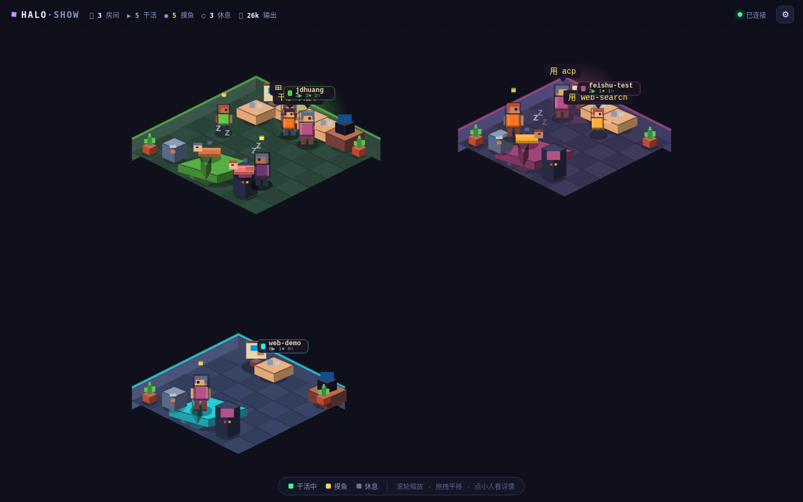

# Halo Show · 像素工坊

A living, pixel-art view of a Halo server's runtime. Every **workspace** is a
room, every **agent session** is a little pixel person, and every **skill** is a
piece of furniture they walk up to and use. Watch them work, fetch coffee, play
the arcade, or curl up and sleep depending on what their session is actually
doing.

It's **read-only** and **100% client-side classic animation** — no LLM, no model
tokens. The only network traffic is one `GET /api/show/state` every few seconds.



## What you see

| In the world | What it means |
|---|---|
| 🏠 Room | A workspace (one per channel-bound workspace the token can see) |
| 🧍 Pixel person | An agent session. Shirt color is derived from the agent id |
| 🪑 Furniture (terminal / bookshelf / workbench / easel / server rack) | A skill available in that workspace. It **glows** when an agent is mid-`activate_skill` on it |
| ↳ smaller person | A sub-agent session (delegated via `start_session`) |
| Speech bubble | The agent's most recent tool call, in plain words ("搜代码", "写文件"…) |

Status drives behavior (it keeps living between polls, so the world is never frozen):

- **干活中 / running** → walks to a desk (or the active skill's station) and works
- **摸鱼 / idle** → wanders, gets coffee, plays the arcade, stretches
- **休息 / stopped** → shuffles to the couch and sleeps (with floating `z`'s)

Click anyone (or a skill station, or empty floor) to open the inspector:
agent name, live status, active skill, last tool, token usage, room, and roster.

## Run it

halo-show is plain static files — no build step. Serve the folder and open it.

```bash
# any static server works; e.g.
cd halo-show
python3 -m http.server 8080
# → open http://localhost:8080
```

On first load it asks for your **Halo server URL** and a **Web Token** (create one
in the admin panel → Channels → Web). A **full**-access token shows every
workspace; a workspace/readonly token shows just its own. Credentials are stored
in `localStorage` only — nothing is sent anywhere but your own Halo server.

You can also pre-fill via URL hash (handy for a kiosk / wall display — the token
is stripped from the address bar immediately):

```
http://localhost:8080/#api=http://localhost:9527&token=YOUR_TOKEN
```

### Serving from the Halo server itself

The Halo server already serves static files. Drop/symlink `halo-show/` so it's
reachable (or front it with any static host) and point the URL at the same
origin — same-origin needs no CORS. Cross-origin is supported too: the server
allows the `x-token` header on the public API.

Controls: **scroll** = zoom · **drag** = pan · **click** = inspect · **F** = fit
all rooms · **Esc** = close panel.

## How it talks to Halo

One endpoint, added to the server's public (token-authed) web surface:

```
GET /api/show/state      header: x-token: <web token>
```

Returns a cross-workspace snapshot: workspaces → sessions (status, last tool,
active skill, token counts) + skills. See `packages/server/src/routes/show.ts`.
The frontend diffs each snapshot into rooms/characters and animates the gaps.

## Files

The world is a single isometric (2:1 diamond-tile) canvas scene, EDG32-palette
pixel art, depth-sorted back-to-front.

```
index.html        shell + HUD + setup modal
style.css         HUD / inspector / modal chrome (the world is all canvas)
js/
  main.js         entry: setup, input (pan/zoom/click), poll loop → world
  api.js          /api/show/state client + polling state machine
  world.js        snapshot → rooms/characters diff, render loop, picking
  room.js         one workspace: iso grid layout + floor/wall/decor drawing
  agent.js        one session: behavior FSM (walk/work/coffee/game/sleep)
  sprites.js      pixel-art primitives (people, furniture, decor)
  iso.js          isometric projection + box/diamond/shadow drawing
  palette.js      EDG32 colors, per-agent look, room themes, shade/tint
  camera.js       pan/zoom transform + hit-testing
  inspector.js    the click-to-inspect detail panel
  util.js         hashing, seeded PRNG, easing, formatting
```

### Offline preview (dev)

`.devmock.mjs` is a tiny standalone server that serves halo-show plus a
**synthetic** `/api/show/state` with fake-but-realistic data, so you can preview
the world with no Halo server running:

```bash
node halo-show/.devmock.mjs       # → http://localhost:8899  (token: anything)
```
